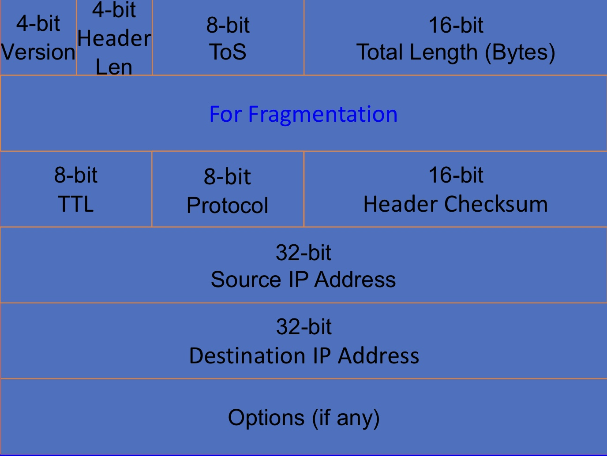
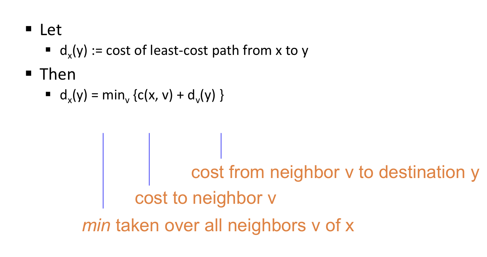

## Lecture 12 Network Layer (IP)
- the first end to end layer from top down  

### Forwarding vs routing
#### Forwarding:
- Directing a packet to the correct interface so that it progresses to its destination
    - local
#### Routing:
- Setting up network-wide forwarding tables to enable end-to-end communication
    - global

How do you forward a packet depends on the info the routing algorithm gives you

### IP Header
we need to  
1. Parse packet, need IP version, and header length
2. Carry packet to dst, need dst IP addr
3. Deal with problems
    - Loops: TTL
    - Corruption: checksum
    - Packet too large: fragmentation fields

- Header length is in unit of 4 bytes, typically 5 for a 20 bytes IPv4 header

- the checksum in IP only uses IP header, not the payload. (The TCP/UCP has its own checksum, From RFC 791: There are some applications where a few data bit errors are acceptable while retransmission delays are not.  If the internet protocol enforced data correctness such applications could not be supported.)

- Special handling:
    - type of service (is depreicated, -> Differentiated Services Code point)
        - allow packets to be treated differently based on needs, i.e. priority

- protocol: identifies the higher level protocol(transport layer) like UDP, TCP

- Fragmentation:
    - every link has a MTU, maximum transmission unit, the largest number of bits if can carry as one unit
    - a router can split a packet into multiple fragments if the packet size exceeds the links' MTU
    - reassembly happened at the destination
        - identifier
        - flags
        - offsets: **in 8 byte units**

## Lecture 13 IP Routers

- Router capacity = Number of external router ports * speed of a port = N * R
    - core router: NR = O(100) Tbps

- input linecards:
    - update packet header
    - longest prefix lookup
- output linecards
    - map packets to flows
    - decide when and which packet to drop
    - decide when and which packet to transmit

- Max-Min fairness
    - if you don't get full demand, no one gets more than you

### scheduling
- round robin
- Fair Queuing
    - for each packet, compute the time at which the last bit of a packet would have left the router if flows are served bit by bit.
    - doesn't eliminate congestion, it just manages the congestion
- weighted fair queuing

router can assist congestion by telling what rate end hosts should use

## rounting
- local routing state: the forwarding table in a single router
- global routing state: the collection of forwarding table in each of the routers

**goal of routing protocols: compute valid state**
- checking validity of routing state
    - focus only on a single destination
    - mark outgoing link with arrow
    - eliminate all links with no arrows

### goal of routing
- find a path to dst -> find a least cost path
    - Dijkstra's

### link-state routing 
- every router knows its local link state
- every router floods its local link state to all other router in the network
- every router learns the entire network graph
- protocol: OSPF messages directly over IP

### distance vector 
- bellman ford equation

from time to time, each node sends its own distance vector stimate to neighbors
    - problem:
        - routing loops, count to inifinity
    - solution
        - poisoned reverse, advertises cost to inf
        - not guaranteed

## 21 wireless
### wireless link (between 2 devices):
- decreases signal strength
- multipath propagation
    - signals bounce off surface and interfere with one another
- interference from other sources, idk like microwave?

### wireless network (multiple interconnected devices)
- anybody in proximity can hear and interfere
- hidden terminal problem
    - occurs when a node can communicate with a wireless access point (AP), but cannot directly communicate with other nodes that are communicating with that AP

### 802.11 wireless LAN (WiFi)
- use CSMA/CA for multiple access
- all have infrastructure and ad-hoc modes
    - infrastructure mode: base stations(access points) connect mobiles to wired network
    - ad-hoc mode: wireless hosts organize themselves to communicate

- AP broadcast beacon messages and mac addr periodically
- Hosts scan all the channels to discover the AP
    - passive scanning
    - active scanning

- 802.11 multiple access
    - CSMA: sense before transmitting
    - CSMA/CA
        - before data transmission, senders sends a request to send (RTS) with the length of the transmission and the destination
        - receiver responds with a clear to send (CTS)
        - sender sends data
        - receiver sends an ACK
        - if sender doesnt get a CTS back, it assumes collision
    - RTS/CTS
        - reserve the channel
        - required to avoid hidden terminals
        - causes exposed node problem 
            - exposed node problem occurs when a node is prevented from sending packets to other nodes because of co-channel interference with a neighboring transmitter.

## 22 Datacenter networking
Requirements
- high bisection bandwidth
    - Fat tree, fatter link on top 

    
